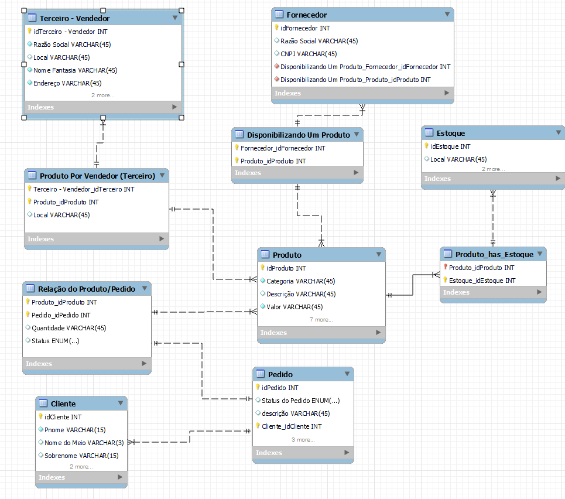

# SQL Ecommerce SQL Model

# Objectives

* Understand SQL Data Flow,
* Learn About How to Develop a SQL Script From Scratch to Finish,
* Model a SQL Diagram to Increase Productivity Over the Project and Decrease the Chance of Errors,
* Learn Some Queries

# Diagramn Of Project

